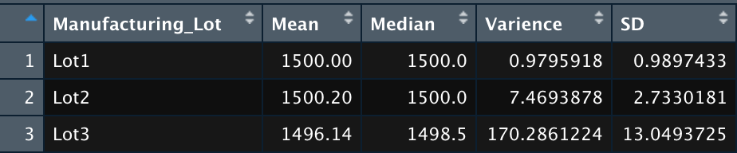

# MechaCar_Statistical_Analysis

## Linear Regression to Predict MPG
Vehicle length and ground clearence provide non-random varience to the mpg values. Vehical length has a Pr(>|t|) of 2.60e-12 and ground clearence has a Pr(>|t|) of 5.21e-08 these low numberes represent a low probability of randomness.

For our linear regression model, the r-squard value is 0.71, which means that roughly 71% of the variability of our dependent variable is explained using this linear model. In addition the p-value of our linear regression analysis is 5.35e-11, which is much smaller than our assumed significance level of 0.05%. Therefor, we can state that there is sufficent evidence to reject the null hypothesis, which means that the slope of our linear model is not zero and can predict the mpg of the MechaCar prototypes effectively.

## Summary Statistics on Suspension Coils

For our general summary of the suspension coils we have a varience of 62.29 psi so it meets the design specifications.

For our indeividual lot summary we see that lot 1 and 2 have a varience of 0.98 psi and 7.47 psi respectivly, meaning they both meet design spesifications. However, lot 3 has a varience of 170.29 psi exceeding 100 psi so lot 3 does not meet design specifications.

## T-Tests on Suspension Coils

For our t.test of all manufacturing lots we have a p-value of 0.06 which is higher than our significance level of 0.05 therefor we failed to reject the null hypothesis meaning that the PSI across all manufacturing lots is not statistically different from the population mean of 1,500 pounds per square inch.

For our t.test of Lot 1 we have a p-value of 1 which is higher than our significance level of 0.05 therefor we failed to reject the null hypothesis. Lot 1 is not statistically different from the population mean. 

For our t.test of Lot 2 we have a p-value of 0.61 which is higher than our significance level of 0.05 therefor we failed to reject the null hypothesis. Lot 2 is not statistically different from the population mean. 

For our t.test of Lot 3 we have a p-value of 0.04 which is lower than our significance level of 0.05 therefor we reject the null hypothesis. Lot 3 is statistically different from the population mean. 

## Study Design: MechaCar vs Competition
1. In my study I would test and compare the metrics of horse power, cost, fuel efficiency, maintaince cost and safety rating. I predict that fuel efficency would be the most important metric for consumers.

2. Hypothesis 
- Ho: Fuel efficiency does not have the most affect on consumers when they buy their cars.
- Ha: Fuel efficiency has the most affect on how consumers buy their cars.

3. I would run a simple linear regression test to compare how fuel efficiency compare to sales of car. Do car with better fuel efficiency tend to sell more than those with poor fuel efficiency. Next i would run a multiple linear regression test to see how all other metrics compare against sales of car. 

4. The data required for thsi test would be total sales of multiple types of cars. This could be car models within a company or the same kind of car such as sedan vs other sedans from competators.